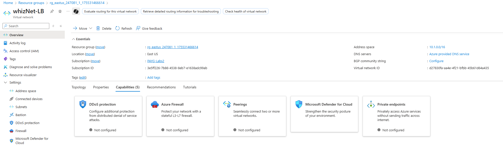
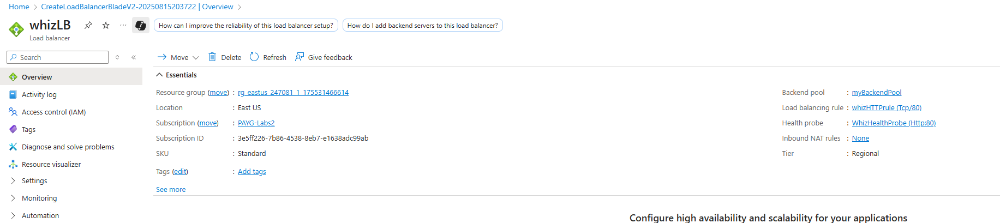
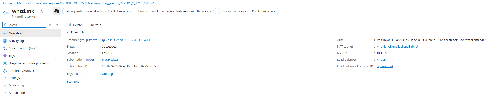
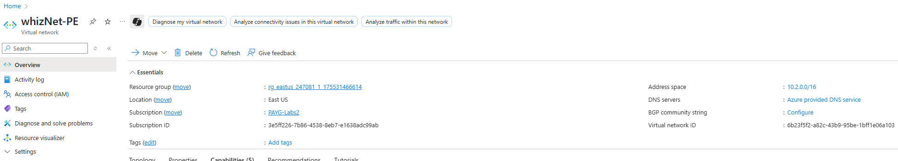
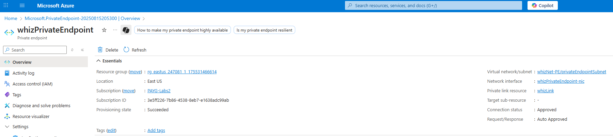
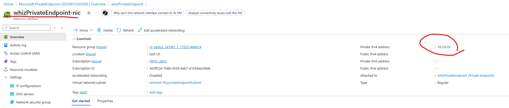

# Configuring Azure Load Balancer with Private Link Service and Private Endpoint – Whizlabs Lab Implementation

Type: Lab Project — AZ-500 Studies  
Skills: Azure Load Balancer, Private Link Service, Private Endpoint, Virtual Networks, Network Security

* * *

## Overview

This project replicates the **Whizlabs “Configuring Azure Load Balancer with Private Link Service and Private Endpoint”** lab in Azure.  
The lab focuses on deploying a virtual network, internal load balancer, private link service, and a private endpoint for secure network communication.

* * *

## Objectives

- Sign in to the **Azure Portal**
- Create a **Virtual Network** for the Load Balancer
- Deploy an **Internal Load Balancer (Standard SKU)**
- Create a **Private Link Service** using the load balancer
- Create a **Virtual Network** for the private endpoint
- Deploy a **Private Endpoint** mapped to the link service
- Retrieve the **Private Endpoint IP Address**

* * *

## What I Did

### 1) Sign in to Azure Portal
- Logged in at [Azure Portal](https://portal.azure.com).

---

### 2) Create Virtual Network for Load Balancer
- Created **Virtual Network** `whizNet-LB` in East US with address space `10.1.0.0/16`.  
- Added subnet `myBackendSubnet` (`10.1.0.0/24`).  

---

### 3) Deploy Internal Load Balancer
- Created **Load Balancer** `whizLB` (Standard SKU, Internal).  
- Added frontend config `myFrontend` (Dynamic, Zone-redundant).  
- Created backend pool `myBackendPool`.  
- Configured load balancing rule `whizHTTPrule` with health probe `WhizHealthProbe`.

---

### 4) Create Private Link Service
- Created **Private Link Service** `whizLink`.  
- Linked to load balancer `whizLB` frontend (`10.1.0.4`).  
- Configured NAT with `whizNet-LB/myBackendSubnet`.

---

### 5) Create Virtual Network for Private Endpoint
- Created **Virtual Network** `whizNet-PE` (`10.2.0.0/16`).  
- Added subnet `privateEndpointSubnet` (`10.2.0.0/24`).  

---

### 6) Create Private Endpoint
- Created **Private Endpoint** `whizPrivateEndpoint`.  
- Connected to **whizLink** (private link service).  
- Placed in `whizNet-PE/privateEndpointSubnet`.  
- Allocated static private IP `10.2.0.10`.  

---

### 7) Get Private Endpoint IP
- Verified assigned private IP address (`10.2.0.10`) from NIC overview.  

---

## Next Steps (outside the lab)

- Integrate private endpoint connections with **App Services or Databases**.  
- Configure **DNS zones** for private endpoints.  
- Route monitoring and auditing logs to **Microsoft Sentinel**.  

* * *

## References

- [Whizlabs – Azure Load Balancer & Private Endpoint Lab](https://www.whizlabs.com/labs/)  
- [Microsoft Docs – Private Link overview](https://learn.microsoft.com/azure/private-link/private-link-overview)  
- [Microsoft Docs – Azure Load Balancer overview](https://learn.microsoft.com/azure/load-balancer/load-balancer-overview)
